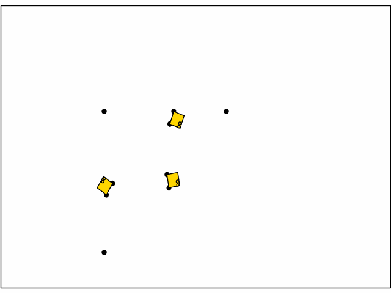

# MARBLER: Multi-Agent RL Benchmark and Learning Environment for the Robotarium
<p float="middle">
  
   
</p>

## Installation
### Install Jax and JaxMARL
1. Create a conda env
    ```
    conda create -n "jaxmarl-rps" python=3.10 ipython
    ```
2. Install JaxMARL (from top of directory)
    ```
    pip install -e .
    ```
3. Install cuda runtime
    ```
    pip install nvidia-cuda-runtime-cu12
    ```
4. Install Jax
    ```
    pip install -U "jax[cuda12]"
    ```
### Install Robotarium Simulator
1. Initialize the Robotarium Simulator submodule
    ```
    git submodule init
    git submodule update
    ```
2. Install (within `jaxmarl/environments/marbler/robotarium_python_simulator)
    ```
    pip install -e .
    ```

## Training
### Config
See `baselines` for config examples. We call out some config parameters here, but see example configs, `marbler/robotarium_env.py` and scenario definitions to better understand all parameters.
```
"ENV_NAME": ...
"ENV_KWARGS": {
  "num_agents": # must be identical to number of robots,
  "max_steps": 100,
  "action_type": # Discrete or Continuous,
  "robotarium": {
    "number_of_robots": # must be identical to num agents,
  },
  "controller": {
    "controller": # controller for robot to go to goal,
    "barrier_fn": # collision avoidance,
  },
  "update_frequency": 30
}
```
Callouts:
- `"action_type"`, if Discrete, actions are interpreted as waypoints to follow, if Continuous, actions are interpreted as unicycle velocity commands, `"controller"` should be set to `null`
- see `constants.py` for available controllers and barrier functions, set to `null` to not use any
- `update_frequency` controls how many robotarium steps are taken per environment step, this speeds up training significantly

### Run Training
**Example**: train a multi-robot navigation policy
```
python baselines/QLearning/qmix_rnn.py +alg=ql_rnn_marbler
```

## Deployment to Robotarium
See `README.md` in `marbler/deploy` for detailed instructions on how to deploy to the Robotarium.